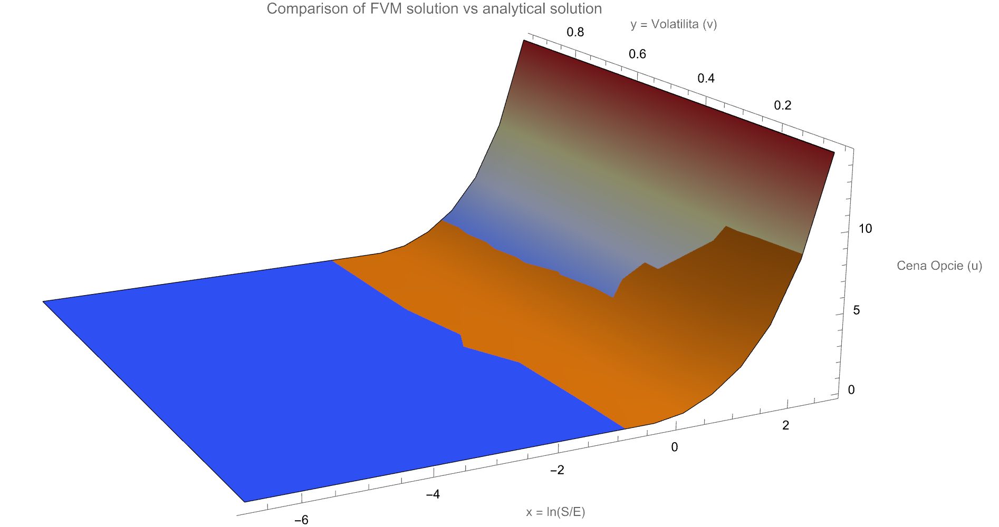
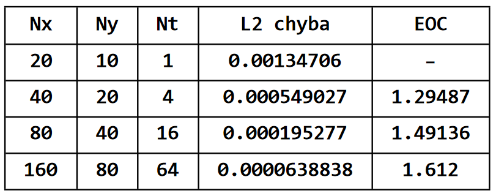

# Heston Model FVM Solver

A C++ solver for the Heston stochastic volatility model, utilizing the Finite Volume Method (FVM) with a diamond-cell approximation. 

This project implements the numerical scheme proposed in the academic paper [*Diamond-Cell Finite Volume Scheme for the Heston Model* (Kútik & Mikula)](https://www.researchgate.net/publication/281482361_Diamond--cell_finite_volume_scheme_for_the_Heston_model). It solves the underlying partial differential equation (PDE), compares the numerical mesh with the analytical exact solution, and exports the data for further error analysis.

##  Mathematical Background

The Heston model relaxes the constant volatility assumption of the Black-Scholes model by allowing the variance $v$ to follow a mean-reverting square root process. The price of a European option $U(S, v, \tau)$ satisfies the following parabolic PDE:

$$
\frac{\partial U}{\partial \tau} = \frac{1}{2} v S^2 \frac{\partial^2 U}{\partial S^2} + \rho \sigma v S \frac{\partial^2 U}{\partial S \partial v} + \frac{1}{2} \sigma^2 v \frac{\partial^2 U}{\partial v^2} + r S \frac{\partial U}{\partial S} + \kappa(\theta - v) \frac{\partial U}{\partial v} - r U
$$

This solver reformulates the equation into a generalized advection-diffusion-reaction equation and discretizes it over a spatial grid using FVM.

$$\frac{\partial u}{\partial \tau}+\mathbf{A}\cdot\nabla u=\nabla\cdot(\mathbf{B}\nabla u)-ru$$

where

$$\mathbf{B}=\frac12 y\left[\begin{array}{cc}1 & \rho\sigma \\\rho\sigma & \sigma^2\end{array}\right]$$
and

$$\mathbf{A}=-\left[\begin{array}{c}r-\frac12 y-\frac12\rho\sigma \\
\kappa(\theta-y)-\lambda y-\frac12\sigma^2\end{array}\right]$$

## Features & Technologies

* **Core Implementation:** Written in C++ 17
* **Linear Algebra:** Powered by the [Eigen](https://eigen.tuxfamily.org/) library for fast matrix operations.
* **Build System:** Cross-platform compilation using CMake.
* **Data Export:** Automated output to CSV for visualization and Experimental Order of Convergence (EOC) analysis.

## Results and Validation

The numerical solution aligns with the analytical exact solution. Below is the graphical comparison between the exact solution (orange surface) and the numerical FVM solution (temperature map surface):

<div align="center">
  
</div>

### Error Analysis
The solver computes the $L_2$ norm to evaluate the Experimental Order of Convergence (EOC). The results confirm the expected second order EOC:

<div align="center">
  
</div>

##  Ongoing Research: M-Matrix Stabilization

* **M-Matrix Stabilization:** As noted in the foundational paper, the standard diamond-cell approximation of the diffusion tensor (specifically dealing with the cross-derivative term $\rho \sigma v S$) does not unconditionally guarantee the M-matrix property of the system matrix. This can occasionally lead to unphysical negative values in the variance domain. I am currently researching robust stabilization techniques by enforcing the discrete principle via M-matrix structural corrections.
* **Parallel Computing:** Implementation of multi-core acceleration using **OpenMP** to reduce computation time and latency for high-resolution grids.

## How to Build and Run

To compile the project, ensure you have a C++17 compatible compiler and CMake installed. The Eigen library is managed automatically via CMake's `FetchContent`.

```bash
# Clone the repository
git clone [https://github.com/tomask80/heston-fvm-solver.git](https://github.com/tomask80/heston-fvm-solver.git)
cd heston-fvm-solver

# Create a build directory
mkdir build && cd build

# Configure and build
cmake ..
cmake --build .

# Run the executable
./HestonSolver
```
